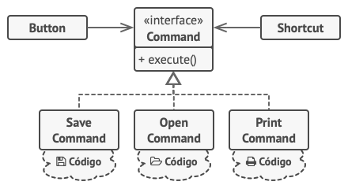
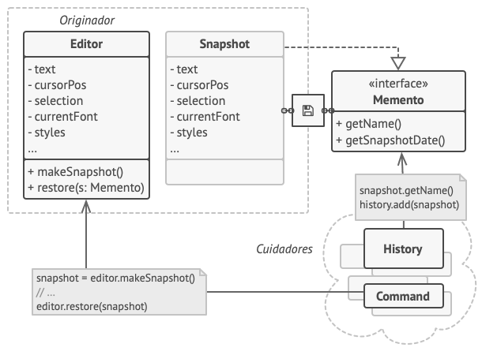
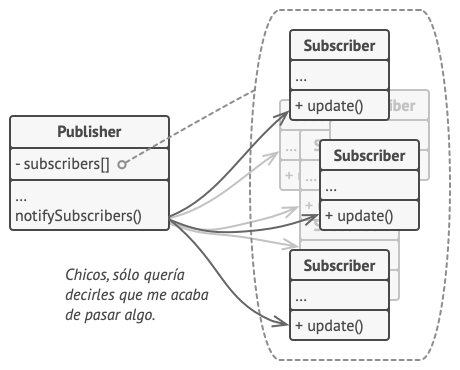
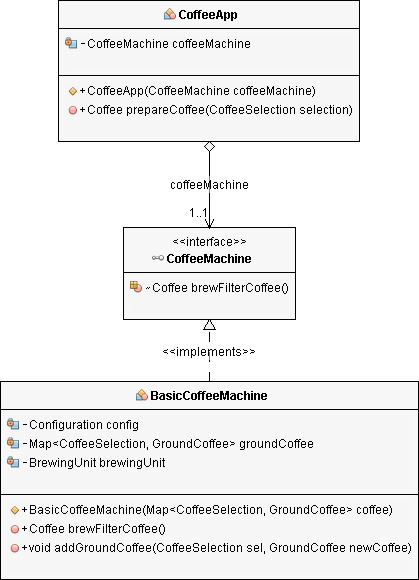
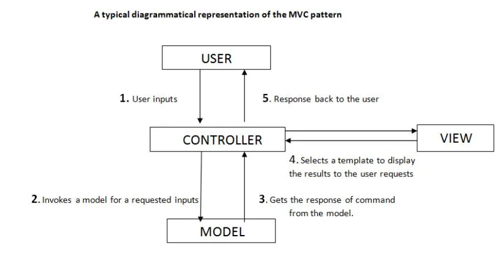

# Patrones
Los **patrones** son una serie de **estructuras** que componen un objeto y se muestran de forma repetitiva,
es decir cuando se repite de forma consecutiva una serie de arquitecturas, objetos o temas se considera un
patrón.

Los patrones vistos desde de una forma mas abstracta es la detección de las variables constantes, que se
identifican dentro de un conjunto de datos.

El requisito que tiene que tener esta serie es que sea predecible, es decir que cumpla una serie de
condiciones para que se logre determinar de forma precisa y acertada cual va a ser el siguiente
elemento que se va a ser parte del patrón, por lo que resultam teniendo una estructura lógica que
nos permite entenderlos a la vez que nos permite encontrar otros en la naturaleza, lo que nos brinda una
mayor comprensión sobre el universo y sus formas únicas en las que funciona.

## Patrones en la estructura de datos
Ahora cuando hablamos de patrones en la estructura de datos resulta que se refiere a una serie de técnicas
comunes usadas para resolver problemas en el desarrollo de software entorno al diseño de interración
o interfaces.

Para que un patrón de diseño sea considerado como tal debe de poseer ciertas características.
Debe de ser comprobado en casos similires dando resultados similires a los anteriores y debe de ser
reutilizable.

## Tipos de patrones
### Patrones Creacionales.

Los patroneas creacionales permiten usar varios mecanismos de creación de objetos, que permiten una mayor
flexibilidad y reutilización de este mismo.

### Singleton

Este patroón de diseño le prove a cada objeto solo una instancia, lo que a su vez le proporciona un acceso
global a la intancia.
* Patrones Estructurales: Separan la interfaz de la implementación. Se ocupan de cómo las clases y objetos
se agrupan, para formar estructuras más grandes.

### Factory

El patrón de creación de fabrica nos permite añadir nuevas subclases a una superclase, esto se hace
para que no se tenga que añadir otra clase que contenga unas características similares a la anterior
superclase, es decir que lo que vamos a hacer es que la clase dependiendo de los objetos que se especifiquen
trabaje de diferente forma el programa o la interfaz.

### Factory Abstract

En la fabirca abastracta lo que tenemos es que tenemos un conjunto de objetos de la misma naturaleza o
en su defecto pertenecen al mismo conjunto, por lo que si tenemos separado cada objeto lo podemos unir
todo mediante una sola interfaz y crear diferentes fabricas para cada familia de elementos, esto lo
hacemos para separar cada fruta, mueble, electronico y objetos que podamos agrupar por grupos, esto
facilita poder añadir nuevos elementos a nuestro código.

Ahora cuando queramos añadir nuevos elementos a cada interfaz nos va a resultar mucho mas sencillo.

### Prototype

El patrón de prototipo nos brinda la posibilidad de poder crear clones de un objeto, esto
lo hace gracias a que creamos una interfaz, en la que está el objeto original y el que
va a ser el clon está dentro de está misma clase, por esto mismo permite que se copie la
información de los objetos, ya que en la mayoría de lenguajes de programación las intancias
que estén dentro de una misma clase se pueden acceder y no tiene un alcance privado.

Ahora el cliente dependiendo de lo que desee realizar podría solo retornar una parte
pequeña del código original o partes diferentes, incluyendo la posibilidad de clonar
el objeto de forma entera.

### Patrones creacionales

Los patrones creacionales nos brindan la posibilidad de escribir programas que sean escalables
y como se pueden ensamblar lo objetos y hacer el puente entre estos para poder hacer el
programa, creando estructuras que las hagan flexibles y eficientes

### Facade

El patrón de fachada nos brinda una forma fácil de administir un complejo subsistema, esto
se hace para que se solo se instancien los objetos que realmente necesitamos para el
funcionamiento del programa, por lo que en pocas palabras podríamos decir que la "fachada"
nos da la posibilidad de administrar todo el programa desde una biblioteca que solo ejecuta
las funciones necesarias o requeridas.

### Decorator

El patron de diseño decorator nos permite crear una interfaz que permite guardar dentro
de ella otras clases, las cuales permiten que se pueda hacer diferentes acciones que
dependen del nivel de empaquetado del archivo. Entre mas profundo sea el nivel mas funcionalidades
tendrá el objeto.

### Proxy

Crea un objeto como intermediario con otro objeto, esto se hace ya que el el objeto de destino
puede ser demasiado grande, por lo que si se usa de forma frecuente perjudica al rendimiento
de la aplicación, por lo que hay entra en juego el proxy ya que solo recibe la información
necesaria y procede a realizarle la petición al objeto principal y retorna a todos los clientes
de objeto los datos que se necesitan del mismo. En pocas palabras es crear un intermediario
que delega la información que pasa por este.

### Patrón de comportamiento

Un patron de comportamiento se usa cuando tratamos con algoritmos y las responsabilidades que
hay entre objetos, por lo que dependiendo del caso podemos pasar solicitudes entre objetos,
haciendo uso de "comandos" que es una cadena de texto que realiza diferentes funciones dependiendo
de lo que se especifique, "iteración", reduce las dependencias que necesitamos para un objeto,
"memento", que nos permite guardar y restaurar el estado previo de un objeto y "observar", que nos
permite configurar objetos que vigilen a otros objetos y notifiquen todos sus movimientos o
procesos.

### Command

Este patrón de diseño permite crear una petición en un objeto independiente que contiene la
información de la solicitud. Esta solicitud permite definir los métodos con diferentes
solicitudes, retrasar o poner en cola una solicitud y soportar operaciones que no se puedan
ejecutar.

Para aplicar el patrón lo que hariamos es pasar todo lo que podemos hacer con una clase y
dentro de esta misma vamos a añadir los respectivos campos que de deben de ejecutar
dependiendo del caso, así tenemos un código mas limpio y que ejecuta de forma rápida los
procedimientos. Lo que hacemos es crear una clase que contenga todoas las funciones
que puede procesar, como lo sería un botón.

### Memento

Es un patrón de diseño que permite guardar y restaurar el estado de un objeto sin
revelar los detalles de su implementación, que sería la forma en que está implementada
el atajo ctrl+z, el cual nos devuelve la información anterior que estaba en el editor de
texto.

Para poder realizar la toma de los datos y poder realizar una "instantanea" de los datos,
lo que hacemos es delegarle al propio objeto que las está creando la tarea de almacenar
estos datos en el objeto que contiene la copie, así no va a ver ningún problema cuando
realicemos modificaciones en el objeto padre.

### Observer

El patrón de observador nos permite hacer una suscripción a un objeto, la cual hace
que nos notifique su estado o las acciones que está tomando, por ejemplo cuando
te suscribes a un canal de YouTube le estás diciendo a un objeto que te notique
cuando el objeto creador suba un nuevo vídeo. La ventaja es que solo notifica a los
objetos que estén suscritos sin obligar a todos a que tengan que saber cuando
le ocurre algo al objeto creador.

### Estrategy

Este patrón nos permite definir una familia de algoritmos los cuales se almacenaran
en una clase diferente por cada uno y sus objetos son intercambiales. Lo que hace es
una clase aparte que va a ser activada por el usuario, el cual va a especificar cual
es el algoritmo que desea usar, esto hace que cada algoritmo sea independiente y que
la misma interfaz sea también lo sea.

### DAO (Data Acces Object)

Dao nos permite separar mediante una clase al lógica de acceso a los datos, por lo que
en pocas palabras sería el separar el acceso a la base de datos del resto de la aplicación,
lo que nos permite hacer que si necesitamos hacer una migración de la base de datos solo
tengamos que modificar la clase contenedora del acceso a la base de datos

### Dependencies injection

Es una técnica de desarrollo de software que permite hacer que una clase sea independiente
de sus dependencias, es decir que pueda funcionar sin necesidad de estas. Esto lo logramos
haciendo que los objetos sean suministrados a una clase.

### MVC

El modelo vista controlador nos permite crear una interfaz, en donde tenemos tres componentes
principales, el modelo, la vista y el controlador, estos le van a indiciar al programa cual
es la petición, el contenido que hay en la base de datos para poder construir este, el
controlador que toma el contenido de la base de datos y lo ordena según sea el caso y el modelo
que es la información ya extraida de la base de dato. El producto final que se muestra termina
siendo la vista.

